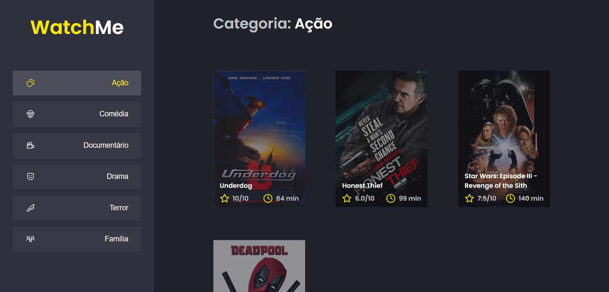

<h1 align="center"> Componentizando a aplicacao WatchMe</h1>

<h3 align="center">
    Listagem de filmes por cartegoria
</h3>

  

  
  
  
    
   
  
  
  
 

<h4 align="center">
	🚧   Concluído 🚀 🚧
</h4>

## 🛠 Tecnologias

<h2>Fake API com JSON Server</h2>

#### **Website**  ([React](https://reactjs.org/)  +  [TypeScript](https://www.typescriptlang.org/))

- Foi utilizado o JSON Server para simular uma API que possui as informações de gêneros e filmes que são usados na aplicação.

## 🚀 Como executar o projeto

- Clonando a aplicação:

<pre>
<code>
  git clone https://github.com/LuzianeFreitas/componentizando-aplicacao.git
</code>
</pre>

- Executando a Fake API

<pre>
<code>
  yarn
  yarn server
</code>
</pre>

- Executando a aplicação 

<pre>
<code>
  // Abra um segundo terminal e execute o comando abaixo
  
  yarn dev
</code>
</pre>

- Acessando a aplicação

<pre>
<code>
  // Abra o navegador e digite
  
  http://localhost:8080/
</code>
</pre>

## 🦸 Autor

  
 <b>Miguel Marçola</b></a> 🚀
  

 

---

## 📝 Licença

Este projeto esta sobe a licença [MIT](./LICENSE).

Feito com muita dedicação por Miguel Marçola 👋🏽 [Entre em contato!](https://www.linkedin.com/in/miguel-mar%C3%A7ola-28535a151/)

---
